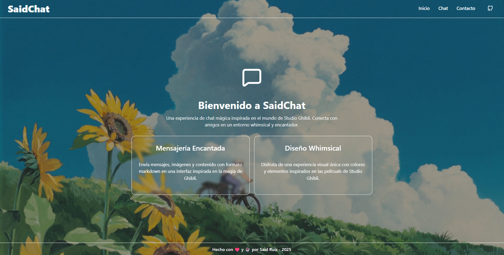

# 🚀 Said Re-Chat

¡Bienvenido a **Said Re-Chat**! 🎉 
Una aplicación de chat en tiempo real, moderna, minimalista y lista para conectar a personas de manera sencilla y divertida.

---

## Visualización


---

## ✨ Características principales

- 💬 **Chat en tiempo real:** Envía y recibe mensajes instantáneamente gracias a WebSockets.
- 🧑‍💻 **Elige tu usuario:** Personaliza tu nombre de usuario antes de entrar al chat.
- 🖼️ **Foto de perfil personalizada:** Usa cualquier imagen de internet como tu avatar para que todos te reconozcan.
- 🎨 **Interfaz moderna:** Inspirada en el estilo Ghibli, con un diseño limpio y atractivo.
- 📱 **Responsive:** Perfecto para escritorio y dispositivos móviles.
- 🔒 **Sin registros ni contraseñas:** ¡Solo elige tu nombre y entra a la conversación!
- 🌙 **Modo oscuro:** Interfaz amigable para tus ojos, ideal para chatear de noche.
- 🧩 **Componentes reutilizables:** Construido con React y TypeScript, usando componentes UI personalizados.
- ⚡ **Experiencia fluida:** Animaciones y transiciones suaves para una experiencia premium.

---

## 🛠️ Tecnologías utilizadas

- **React** + **TypeScript**
- **Vite** para desarrollo ultrarrápido
- **TailwindCSS** para estilos modernos
- **WebSockets** para comunicación en tiempo real
- **ShadCN** para componentes accesibles y personalizables

---

## 🚦 ¿Cómo empezar?

1. Clona el repositorio:
   ```bash
   git clone https://github.com/tu-usuario/said-re-chat.git\
   ```

2. Instala las dependencias:
   ```bash
   npm install
   ```

3. Inicia el servidor de desarrollo:
   ```bash
   npm run dev
   ```

4. Inicia el servidor WebSocket:
   ```bash
   npm start
   ```

5. ¡Listo! Abre http://localhost:5173 y comienza a chatear.

---

## 🖼️ Personaliza tu experiencia

- Nombre de usuario: Elige cualquier nombre antes de entrar.
- Foto de perfil: Pega el link de cualquier imagen pública (por ejemplo, tu avatar de GitHub).

---

## 🤝 Contribuciones

¿Tienes ideas para mejorar el chat? ¡Las contribuciones son bienvenidas! Haz un fork, crea tu rama y envía un pull request 🚀

---

## 📄 Licencia

Este proyecto está bajo la **Licencia MIT Modificada - Said Re-Chat**.  
Consulta el archivo [LICENSE](./LICENSE) para más detalles.  
**No está permitido copiar y pegar el código literalmente, ni venderlo, y siempre deben mantenerse los créditos al autor.**

---

## 📢 Nota importante

Las fotos de perfil deben ser enlaces públicos (por ejemplo, imágenes de internet). No se almacenan imágenes en el servidor, ¡así que tu privacidad está protegida!

---

## 🧙‍♂️ Autor

Desarrollado con 💙 por [Said Ruiz](https://said-beta.vercel.app)